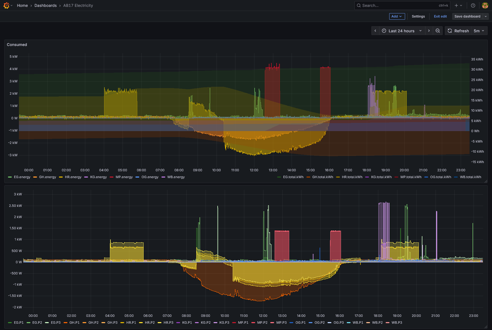

# Read Refoss EM06 energy data and feed into InfluxDB

This python script reads the electricity measurements from one or more Refoss EM06 6-Channel Energy Meters

Setup:
  1. Python3 with necessary pip modules installed, including influxdb API, see includes in script.
     
  3. Optional, crontab to launch the reader the desired intervals, example:
     ```
     *  *  *  *  *   python3 /opt/refoss-em06-influxdb.py -r=192.168.5.15/EG/OG -r=192.168.5.14/KG/GH 2>&1 >> /var/log/refoss-em06-influxdb.log
     ```
     
     Note: multiple `-r <IP-Address>` allows the
     
     Commandline properties help with: 
     `/opt/refoss-em06-influxdb.py --help`
     ```
     Refoss EM06 energy reader and InfluxDB writer
     
     options:
       -h | --help            show this help message and exit
       -r | --refossEM06 192.1.1.1/A/B
                              The EM06 device IPAddress with two names /A/B for two 3-phase groups 
                              or as default 'A1/B1/C1/A2/B2/C2'
       -i | --dbip DBIP       The influxdb IP-Address
       -d | --dbname DBNAME   The influxdb name
       -u | --dbuser DBUSER   The influxdb username
       -t | --dbtoken DBTOKEN The influxdb password or token
       -n | --nowrite         skip writing to database
       -v | --verbose         show verbose output
     ```
     Note: you can hardcode the `DBNAME`, `DBUSER` and `DBTOKEN` in your copy of the script to keep the cmdline call short.

     The influxdb line-format created looks like:
     ```
     electricity,name=EG,phase=1,ip=192.168.5.15 voltage=235846,current=144,power=-3680,factor=-0.10810816287994385,consumed=-1668 1762030929119
     ```

  4. [influxdb](https://www.influxdata.com/get-influxdb/) (currently I'm using version 2.10)
     - with a bucket and access token configured, and for InfluxDB2 also a `dbrp` mapping to allow line-format writes.
       (In my case the bucket is simply called `electricity`.)
  
  5. [grafana](https://grafana.com/grafana/) (currently I'm using version 12.1.0) with
     - a data source configured to access the influxdb bucket
     - [dashboard](refoss-em06.json) to display the battery values


## Screenshot:


## License
Apache-2.0 license
